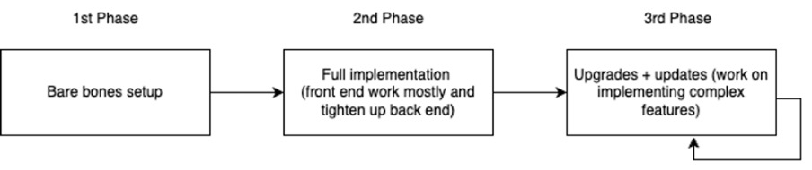

# Phase plan

Broken into phases where each phase could take a couple of months. 

Theories

1. 1st phase will be the foundation of the project. 
2. 2nd phase will take the longest to work on in terms of bringing the project alive
3. 3rd phase is complete creative freedom from suggested use cases

Idea

1. 1st phase would be us working on just user accounts, one use case - word counter from bare testbox and text, making the processing happen in backend. No fancy front end designs, very basic HTML and JS. Maybe some CSS designs but not needed.
2. 2nd phase would be making sure word count is implemented in front end, and rest of use cases are implemented along with full front end designs such as notebooks and colour palette. This would be the longest and hardest phase in my opinion. This would have use make our knowledge of DSA come to life with data storage optimisation too
3. 3rd phase would be adding complex features (upgrades) and constant updates and improvements. 

Conundrum - will be voted on - [https://surveys.delighted.com/c/u/Jn7vskhw](https://surveys.delighted.com/c/u/FKuX4P5S)

Do we either go head first into this where some of us work on some parts 

OR
Work on a very basic implementation of our 1st phase on local storage so we all have knowlege of nodeJS- takes a little longer.